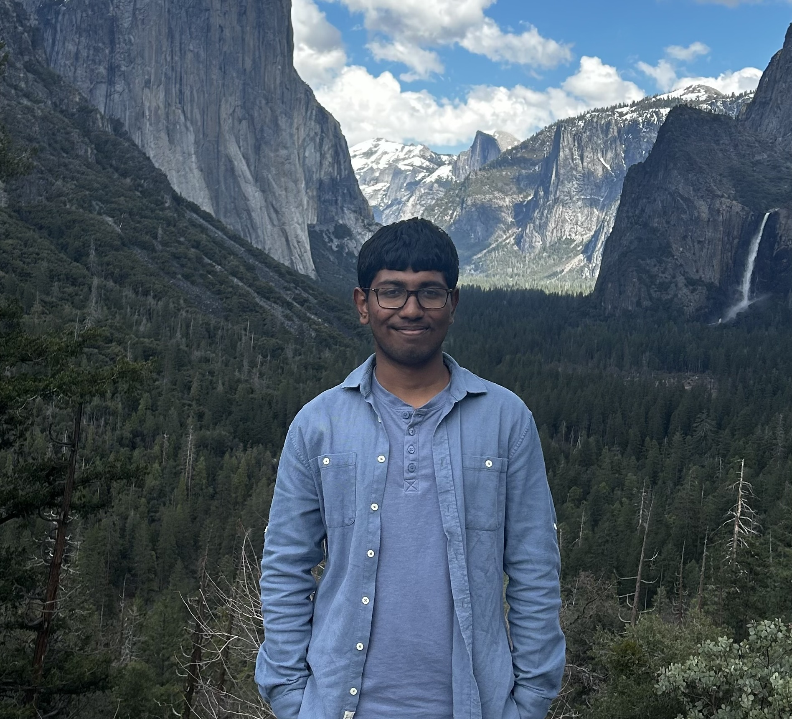
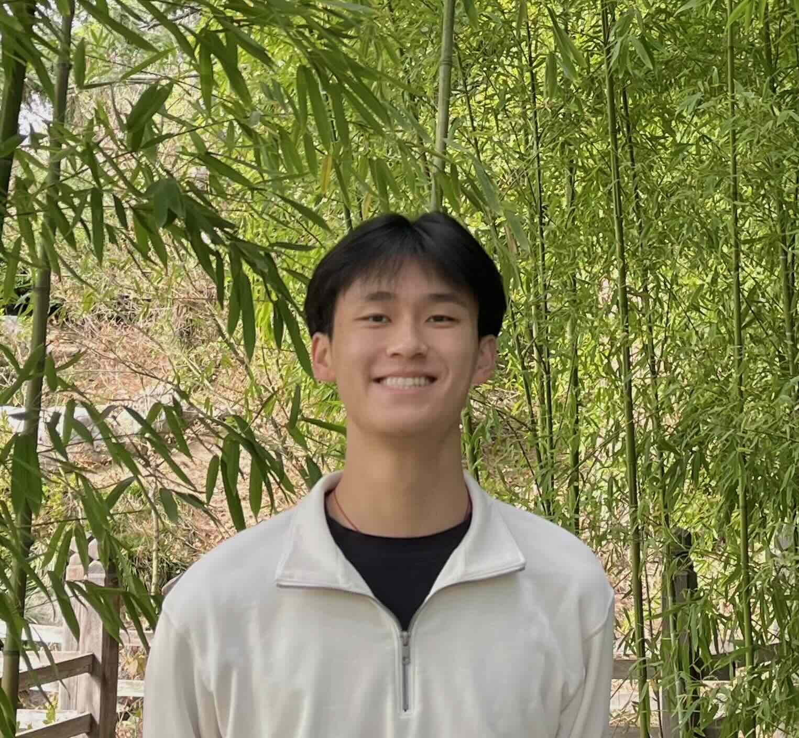
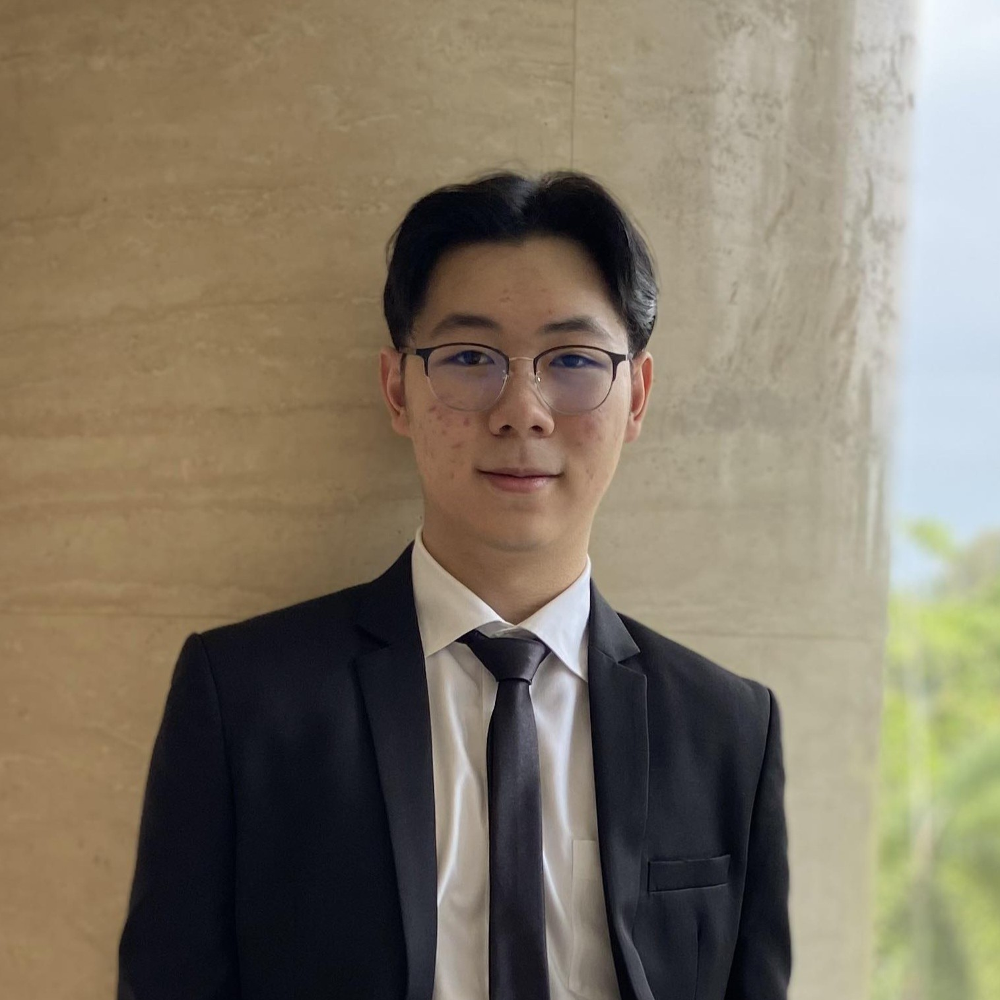
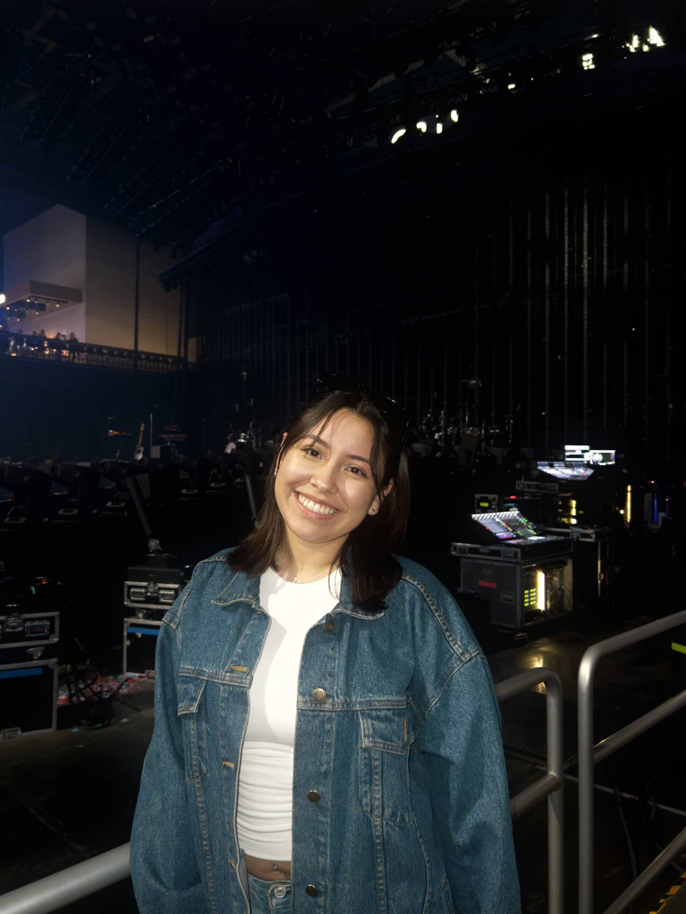
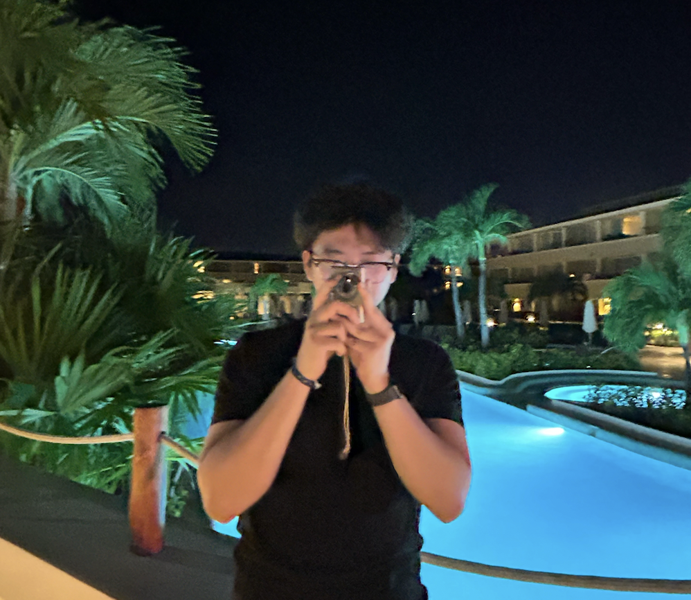
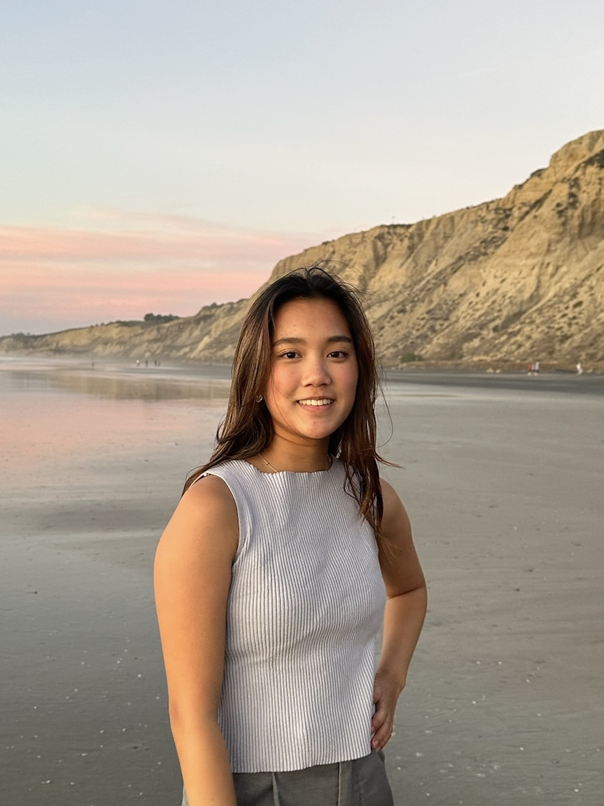

# The 11X developers

## Core Values

## About our Team

#### Sachin
 

Hello! I'm a second-year at UCSD majoring in Computer Science. 

During my free time, I love to
* Explore Sunny San Diego ☀
* Travel to new places ✈️
* Debug my life 👨‍💻

Fun fact: I love cooking fusion dishes that can offend multiple cultures at the same time 🥘👨‍🍳

#### Wyatt
 

Hello! I'm a third-year at UCSD majoring in Computer Science. Some of my hobbies include:
* Playing badminton 🏸
* Undergoing big-back activities 🧋🍱
  
A fun fact about me is I recently travelled to Boston to compete in the annual National Collegiate Team Tournament representing UCSD

#### Lucas
  
 
 Hii! I'm a second-year Computer Science major here at UCSD. Some hobbies of mine are:
 * cooking Asian dishes
 * playing the guitar (i suck)
 * playing video games with friends 
   
 Fun Fact: I've tried to learn Chinese 4 different times in my life meaning its been around 10 years, yet I still can't speak the language 😭

#### **Verania Salcido**
  
 Hello! My name is Verania Salcido and I'm currently a 3rd year Computer Science major at Muir college! 
 
 A little bit about me:
 - I love getting sweet treats 🍬 🍭
 - I love doom scrolling on tiktok 📱🤳
 -  See my Github profile [here](https://github.com/vesalcido)!

#### Khang
 

Hi! I'm a 2nd year UCSD student majoring in Computer Science and minoring in Cognitive Science. 

Here is my [GitHub Page](https://github.com/khanggn)

When I have free time I like to:
* Go to the gym or a run 🏃‍♂️
* Binge Youtube or Netflix
* Sleep
* Eat

Fun Fact: I have a Pokemon card addiction and its not healthy.

#### Alan
 

Hello! I'm Alan and I am a third year computer science student at Muir college! 

Aside from programming, some of my hobbies include: 
- Drawing (I hope to be a freelance artist on the side one day)
- Listening to music (favorite band of all time is My Chemical Romance)
- Playing video games (fun fact: I've been playing Smash Bros since I was 8) 

#### Mia
 
Hi! I am a 2nd year Computer Science major at UCSD, Sixth College. See my Github profile [here](https://github.com/miachen67).

In my free time, I enjoy:
* Being outdoors - hiking, running, surfing 🏔️
* Cooking/eating yummy food 🥘🍱
